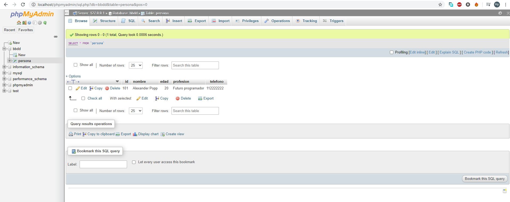

# base-de-datos-java-sql
Hecha con patron MVC
importar la tabla que esta en la carpeta bbdd a un sql server (yo utilize xampp para ejecutar el servidor), con el mismo
nombre para no modijicar el proyecto, y luego ejectutar el programa.

